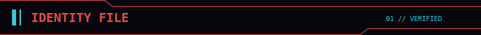
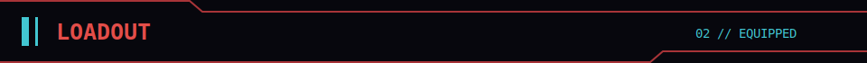
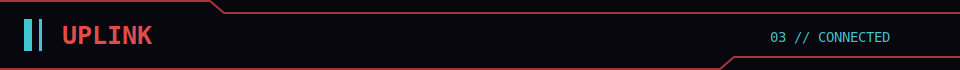

  

 

  

<table width="100%">
  <tr>
    <td><code>网络代号 / HANDLE</code></td>
    <td><strong>CHAKE111</strong></td>
    <td><code>VERIFIED</code></td>
  </tr>
  <tr>
    <td><code>身份 / ROLE</code></td>
    <td><strong>FULL-STACK ENGINEER</strong></td>
    <td><code>ONLINE</code></td>
  </tr>
  <tr>
    <td><code>方向 / FOCUS</code></td>
    <td><strong>WEB SYSTEMS</strong></td>
    <td><code>LOCKED</code></td>
  </tr>
  <tr>
    <td><code>模式 / MODE</code></td>
    <td><strong>BUILD / SHIP / ITERATE</strong></td>
    <td><code>ACTIVE</code></td>
  </tr>
</table>

 

  

<table width="100%">
  <tr>
    <td><code>后端 / BACKEND</code></td>
    <td>Java · Spring · Maven · RabbitMQ</td>
    <td><code>ACTIVE</code></td>
  </tr>
  <tr>
    <td><code>前端 / FRONTEND</code></td>
    <td>Vue · TypeScript · Vite · Pinia</td>
    <td><code>ACTIVE</code></td>
  </tr>
  <tr>
    <td><code>数据 / DATA</code></td>
    <td>MySQL · Redis · MongoDB · Elasticsearch</td>
    <td><code>ONLINE</code></td>
  </tr>
  <tr>
    <td><code>交付 / DELIVERY</code></td>
    <td>Docker · Jenkins · Nginx · Git</td>
    <td><code>READY</code></td>
  </tr>
</table>

 

  
    
  <a href="https://wakatime.com/@chake111"><code>WAKATIME // CONNECTED</code></a>

